# Architecture

Vidar is a source-to-source compiler written in TypeScript. It reads `.vidar` files (Odin plus a few constructs), checks them, and writes an Odin package tree. The `odin` compiler then builds that tree. Vidar never produces machine code.

```mermaid
flowchart LR
    src[".vidar / .odin files"] --> lex["lexer.ts"]
    lex --> parse["parser.ts"]
    parse --> load["project.ts<br/>follow imports,<br/>group import cycles"]
    load --> an["analyzer.ts<br/>scopes, types, captures,<br/>macro expansion"]
    an --> chk["escape.ts, checks.ts,<br/>autoopt.ts (-opt)"]
    chk --> emit["emitter.ts<br/>lower and re-emit"]
    emit --> out["Odin tree + vidar.map.json"]
    out --> odin["odin build / run / check / test"]
    odin --> map["runmap.ts<br/>errors and panics back to .vidar lines"]
```

## Stages

1. **Lex and parse** ([lexer.ts](../../src/lexer.ts), [parser.ts](../../src/parser.ts)). The lexer inserts Odin's automatic semicolons and keeps whitespace and comments on each token. Every AST node keeps its token range, so unchanged code can be written back byte for byte. This is why plain Odin passes through unchanged.
2. **Load the program** ([project.ts](../../src/project.ts)). `loadProgram` starts at the entry package and follows every import by relative path, or by a collection declared in `vidar.toml` ([manifest.ts](../../src/manifest.ts)). `vidar:sched` is loaded from a string in [sched.ts](../../src/sched.ts). Packages that import each other (strongly connected components, found with Tarjan's algorithm) are grouped into one *unit*, which becomes one Odin package.
3. **Analyze** ([analyzer.ts](../../src/analyzer.ts)). Builds scopes for every package, resolves imports and members, applies the capture rules for closures, infers types on a best-effort basis and expands macros. The built-in macros come from [prelude.vidar](../../src/prelude.vidar). User macros (`proc!`) run in the interpreter in [comptime.ts](../../src/comptime.ts), which also handles `quote`, splicing and hygiene.
4. **Check and decide.** [escape.ts](../../src/escape.ts) reports a closure holding `&x` that outlives `x`. [checks.ts](../../src/checks.ts) handles `@(no_alloc)` and `@(hot)`. With `-opt`, [autoopt.ts](../../src/autoopt.ts) and the files it uses (`optimize.ts`, `soa.ts`, `reorder.ts`, ...) pick the rewrites and record each decision as a hint, which feeds `-opt-report` and the editor's inlay hints.
5. **Emit** ([emitter.ts](../../src/emitter.ts)). Re-emits the tokens of each file and lowers the new constructs: closures, interfaces, error handling, anonymous structs and macro expansions. It also writes the generated `vidar_runtime` package, whose source is a string in the same file. `emitProgram` returns the output files, the source file each came from, and a map from every output line to its source line.
6. **Build and map back** ([cli.ts](../../src/cli.ts), [runmap.ts](../../src/runmap.ts)). The CLI writes the tree and `vidar.map.json`, then runs `odin`. Errors, panics and test failures that mention generated `.odin` locations are rewritten to `.vidar` locations.

## Rules that hold the design together

- **Lines are preserved.** A lowered construct takes as many lines as its source, and lines that Vidar does not rewrite stay identical. Error mapping and the language server's forwarding to `ols` depend on this.
- **Generated names start with `__`.** Anything the user did not write is hidden from completion by that prefix.
- **`-opt` never changes behavior.** The test runner builds both settings and compares the output.
- **Two runtime packages are strings in TypeScript.** `vidar_runtime` (in `emitter.ts`) and `vidar:sched` (in `sched.ts`). Changing either rewrites the expected output of every test case that uses it.

## Other consumers of the same pipeline

- **Language server** ([src/lsp/](../../src/lsp)). Reuses `loadProgram` in tolerant mode (errors are collected, not thrown) and `emitProgram` with column maps. It keeps a shadow Odin tree and forwards plain-Odin requests to `ols`. See [Language server](../tools/language-server.md).
- **Formatter** ([format.ts](../../src/format.ts)). Works on tokens only and does not use the analyzer. See [Command line](../cli.md#vidar-fmt).
- **Standalone binaries** ([bin.ts](../../src/bin.ts)). The compiler bundled into a Node single executable. `vidar-lsp` is the same file under a second name.

For the file-by-file list, see [Source layout](source-layout.md).
